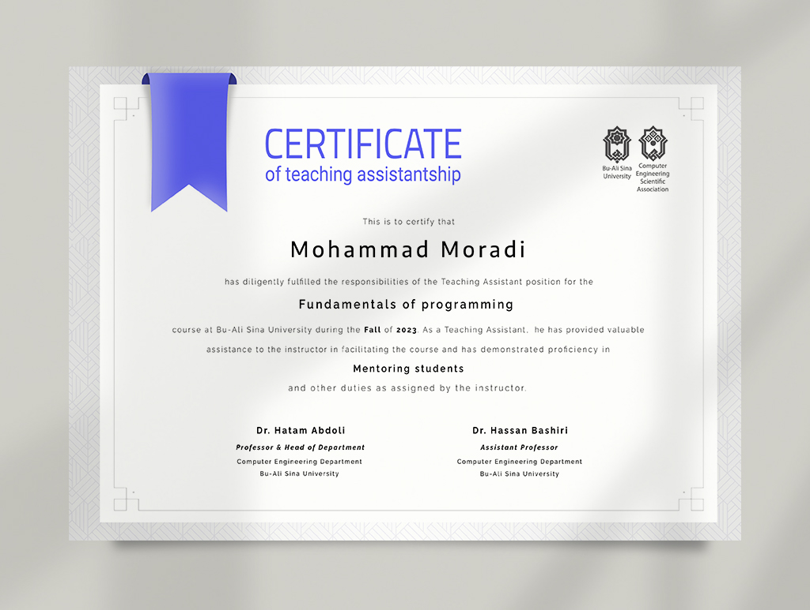

# TA-Certificate

## Teaching assistant certificate
If you have been a teaching assistant and need a certificate of this activity for your resume, university, workplace or otherwise, here is the solution.

## How to use?
You can download [TA-Certificate.rar](TA-Certificate.rar) file. You must extract it and open psd file in Adobe Photoshop.

You must personalize the information in the certificate for yourself.

### Do I need to install Photoshop?
Not necessarily. You can open this Photoshop file in the online environment such as [photopea.com](https://www.photopea.com) and edit.

## Special thanks
Thanks to Syd Aria Mousavifar, Hossein Shakibania, Mohammad Moradi, Sajad Dehghan, who were diligent in preparing these certificates.
